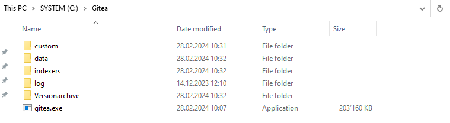
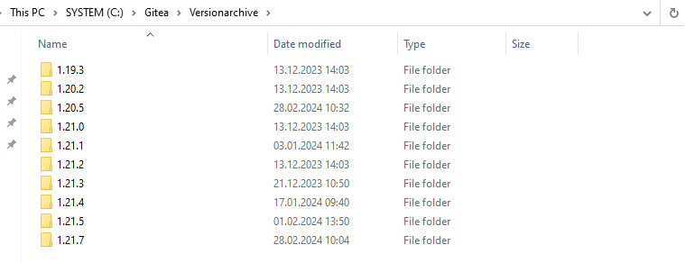

# PowerShell Script Explanation

This PowerShell script is designed to automate the update process for the Gitea service running on a Windows server. Below is a breakdown of the script's functionality:

## 1. Read Settings from JSON File

The script starts by reading settings from a JSON file named `settings.json` using the `Get-Content` cmdlet and then converting the JSON content to a PowerShell object using `ConvertFrom-Json`.

## 2. Establish Credentials

It then establishes credentials for two scenarios: accessing a proxy server (`$proxycreds`) and accessing the Windows server (`$WindowsCreds`). Secure strings are created from plaintext passwords provided in the settings JSON.

## 3. Set Headers for API Request

The script sets up headers for an API request to GitHub in order to retrieve the latest release information of Gitea.

## 4. Retrieve Current and Latest Gitea Versions

Using `Invoke-RestMethod`, the script retrieves the latest release information of Gitea from GitHub and the current installed version from the Gitea server.

## 5. Compare Versions

The script compares the current installed version with the latest release version obtained from GitHub.

## 6. Update Gitea if Needed

If the latest release version is newer than the current installed version, the script proceeds with the update process.

- It downloads the latest Gitea release executable from the GitHub release assets.
- It creates a PowerShell drive and directory to store version archives. My gitea install directory looks like this:
  
  Versionarchive will look like this:
  
- It downloads the executable file to the specified directory.
- It stops the Gitea service, replaces the executable with the new version, and then restarts the service.

## 7. Display Update Status

Finally, the script displays appropriate messages based on the update status:

- If the current version is older, it indicates the update process is in progress.
- If the versions are the same, it indicates that no update is necessary.
- If the current version is newer, it indicates an unexpected scenario.

The script handles potential errors during each step of the process and displays relevant error messages.
